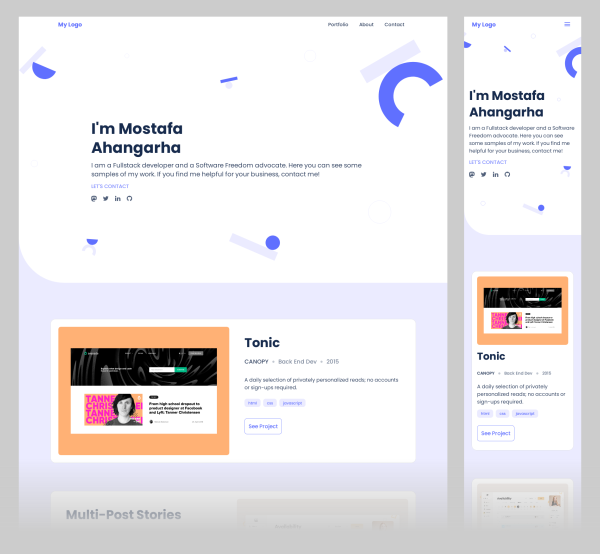

# Portfolio

> This is an educational project for making a professional portfolio

## Screenshots

## Built With

- HTML/CSS

## Getting Started

By now, the project is a static HTML/CSS and doesn't need any steps for build.

## Authors

👤 **Mostafa Ahangarha**

- GitHub: [@ahangarha](https://github.com/ahangarha)
- Mastodon [@ahangarha@mas.to](https://mas.to/@ahangarha)
- Twitter: [@ahangarha](https://twitter.com/ahangarha)
- LinkedIn: [ahangarha](https://linkedin.com/in/ahangarha)

## 🤝 Contributing

As an educational project at least at this stage I am not supposed to accept any PR. Yet I appreciate if you can report problems from [issues page](../../issues/).

## Show your support

If you think I am on the right track, give a ⭐️.

## 📝 License

This project is [MIT](./LICENSE) licensed.
